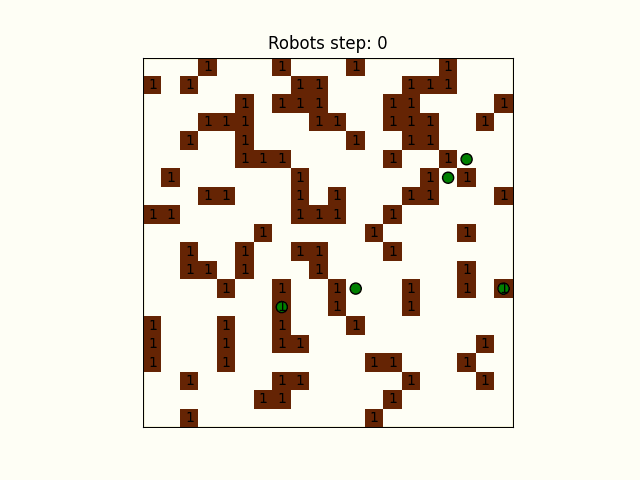

# Evidencia-1.-Actividad-Integradora-Multiagentes
Repositorio que da respuesta a la situacion planteada en la "Evidencia 1. Actividad Integradora (Multiagentes)" de la clase  "Modelación de sistemas multiagentes con gráficas computacionales", en este repositorio se puede observar el uso de agentes, de simulaciones de los mismo, asi como el empleo de librerías de python como "mesa" y "matplotlib" 

Planteamiento del problema
La situación que se plantea es que tenemos un almacén de 20x20 con 100 cajas en el mismo esparcidas al azar, nuestro objetivo es apilar todas las cajas en montones de 5 cajas, es decir terminar con 20 pilas de cajas. Además los robots, en total 5 de ellos,  recogen cajas de manera adyacentes a ellos (izquierda, arriba, abajo, derecha) y  se mueven de la misma manera, solo pueden llevar una caja a la vez.

Para dar solución a este problema se desarrollaron dos algoritmos de recolección y acomodo de cajas, el primero de ellos siendo un algoritmo ineficiente y en el cual contribuye el azar, el segundo de ellos es un algoritmo altamente eficiente en el cual se planteó una estrategia para minimizar la cantidad de pasos necesarios para lograr el objetivo.

Simulacion no eficiente

Simulacion eficente

